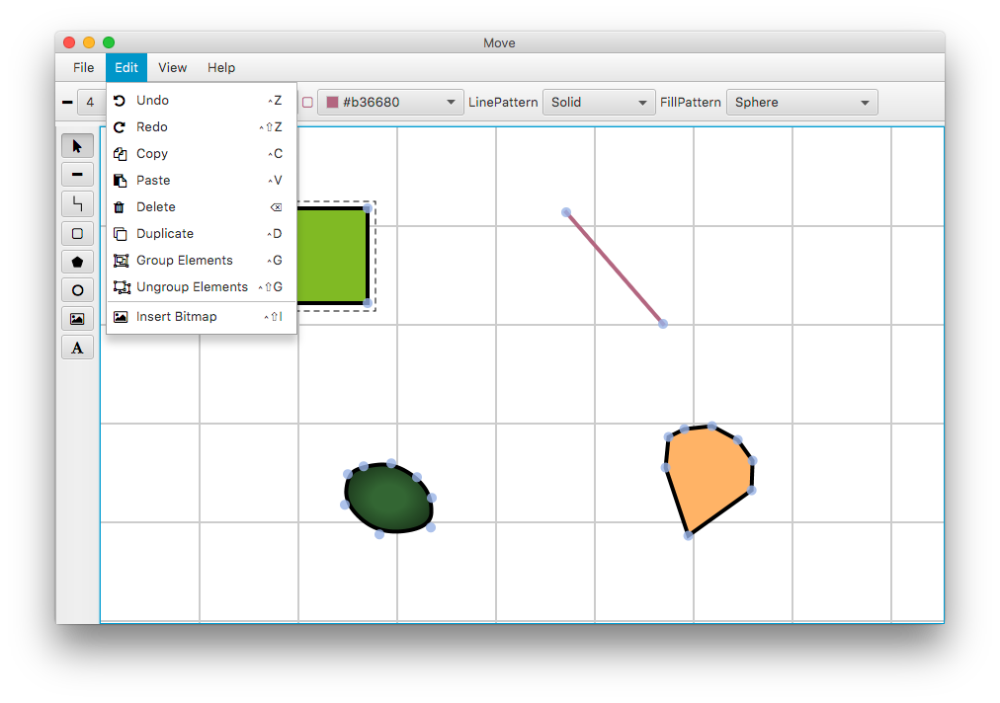

= Modelica Vector graphics Editor (MoVE)

The Modelica Vector graphics Editor (MoVE) is a cross platform graphical editor for
Modelica's **icon** annotation. MoVE opens the opportunity to create the graphical
representation of a model in a view minutes using a comfortable user interface.

== Unique features
MoVE contains some features that are unique and missing in similar projects:

- [x] generate pretty printed or one line annotation code
- [x] create **straight lines**, **circles** and **squares** by holding down the shift key
- [x] rotate the shapes
- [x] import existing models
- [x] import images and embed them either base64 encoded or
- [x] export your icons as **svg** or **png**
- [x] group and ungroup shapes

== Get a taste
==== Version 0.5 on Mac OS X
image::doc/move-v0.5.png[]
==== Version 0.7 on Mac OS X

==== Generated formatted Modelica code
[source, modelica]
----
model test
  annotation(
  Icon (
    coordinateSystem(
      extent = {{0,0},{754,497}}
    ),
    graphics = {
      Ellipse(
        lineColor = {0,0,0},
        fillColor = {26,51,153},
        fillPattern = FillPattern.Solid,
        lineThickness = 4.0,
        extent = {{110,290},{288,112}},
        endAngle = 360
      ),
      Polygon(
        points = {{491,230},{543,269},{593,237},{612,301},{518,336},{433,269}},
        lineColor = {255,128,128},
        fillColor = {77,128,77},
        fillPattern = FillPattern.Solid,
        lineThickness = 4.0
      ),
      Rectangle(
        lineColor = {26,51,153},
        fillColor = {230,230,77},
        fillPattern = FillPattern.Solid,
        lineThickness = 1.0,
        extent = {{70,401}, {335,358}}
      ),
      Line(
        points = {{250,460},{541,460}},
        color = {179,26,26},
        thickness = 8.0
      )
    })
  );
end test;
----

== Installation
=== Dependencies
- OpenJFX on systems which uses the http://openjdk.java.net/[OpenJDK]

=== Using compiled releases
In order to install MoVE using our precompiled releases,
first check that you have a valid
http://www.oracle.com/technetwork/java/javase/downloads/jre8-downloads-2133155.html[Java JRE version 8]
installed. After that
https://github.com/THM-MoTE/MoVE/releases/download/v0.7.0/Move-0.7.0.jar[grab the jar]
and run it by either double-clicking the jar or running the following
command in your terminal:
[source, sh]
  $ java -jar Move-0.7.0.jar &

=== Install from source
For installing from source follow this steps:

- install a http://www.oracle.com/technetwork/java/javase/downloads/jdk8-downloads-2133151.html[Java JDK version >= 1.8.0_77]
- install http://www.scala-sbt.org/[sbt]
- clone the repository `git clone https://git.thm.de/njss90/move.git`
- get into the directory and run  `sbt ";compile;run"`

== License
(C) 2016 Nicola Justus.

MoVE is is distributed under the terms of the
https://www.mozilla.org/en-US/MPL/2.0/[Mozilla Public License Version 2.0].
See
https://github.com/THM-MoTE/MoVE/blob/master/LICENSE[LICENSE]
file for copying permission.
