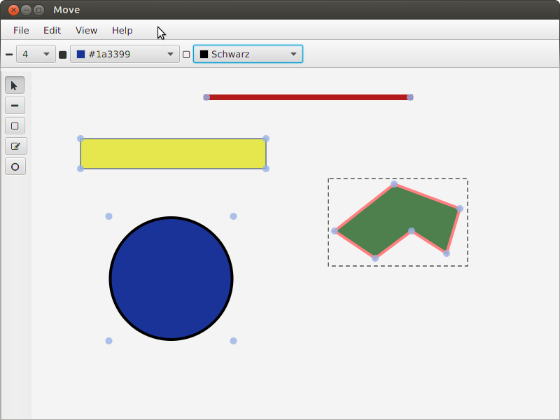
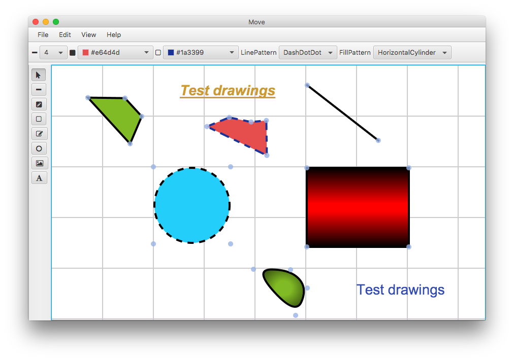
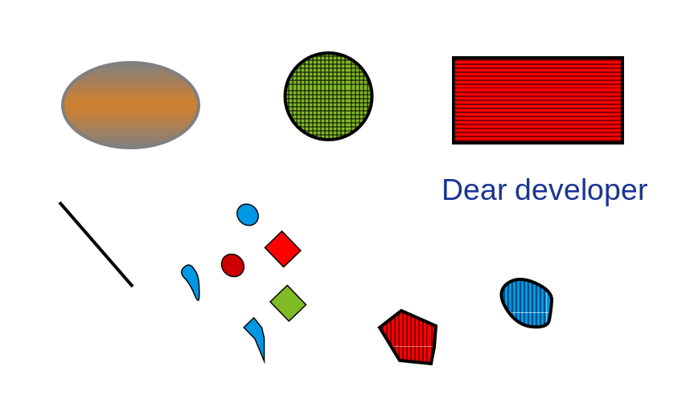

# Modelica Vector graphics Editor (Move)

Move is a __cross-plattform__ graphical editor for __Modelica's graphical objects__.
With Move you can create your Modelica-Models in a few minutes. Move has a handy, beautiful UI.

Move supports all basic editing you need or miss in similar projects:
- Draw __straight__ lines (either horizontal or vertical),  __real__ circles, squares, polygons and much more
- Resize the shapes in __4 regions__
- Move shapes
- Rotate shapes
- import your Modelica-Icons from existing models
  (this even works if there are multiple models in the file)
- import your favorite bitmaps in nearly every image format (jpeg, jpg, png, bmp, gif) either as URL or encoded in base64
- Layout elements at a grid with __snap-to-grid__ (can get disabled)
- Group and ungroup shapes
- undo and redo your last few editings
- generate either __formatted__ or __one-line__ Modelica code
- simple shortcuts that can be remembered or changed if you prefer others
- create __SVG-Images__ from your created Icons
- create __PNG-Images__ from your created Icons

__Move is fast!__ Nearly every feature works in real time!

## Configuration & Shortcuts
The configuration for move is a simple text file placed inside ```~/.move``` called
```move.conf```. This file can get edited by everyone with a text-editor.
Same counts for shortcuts. Shortcuts are configured over ```shortcuts.conf```.

## Get a taste
#### Version 0.1 on Ubuntu


#### Version 0.5 on Mac OS X


### Generated formatted Modelica code
``` modelica
model test
  annotation(
  Icon (
    coordinateSystem(
      extent = {{0,0},{754,497}}
    ),
    graphics = {
      Ellipse(
        lineColor = {0,0,0},
        fillColor = {26,51,153},
        fillPattern = FillPattern.Solid,
        lineThickness = 4.0,
        extent = {{110,290},{288,112}},
        endAngle = 360
      ),
      Polygon(
        points = {{491,230},{543,269},{593,237},{612,301},{518,336},{433,269}},
        lineColor = {255,128,128},
        fillColor = {77,128,77},
        fillPattern = FillPattern.Solid,
        lineThickness = 4.0
      ),
      Rectangle(
        lineColor = {26,51,153},
        fillColor = {230,230,77},
        fillPattern = FillPattern.Solid,
        lineThickness = 1.0,
        extent = {{70,401}, {335,358}}
      ),
      Line(
        points = {{250,460},{541,460}},
        color = {179,26,26},
        thickness = 8.0
      )
    })
  );
end test;
```

### Generated SVG-Image


# Try it
If you like to try it follow these steps:
- Make sure you are using JDK version >= __1.8.0_77__ by running ```java -version```
  (Because of a bug in the JavaFX lib that causes strange
  behavior from the JavaFX-FileChooser we need JDK version >= 1.8.0_77)
- Make sure you have a ```$JAVA_HOME``` environment variable which holds the path to the
  java-home directory.

  (We need this variable for including JavaFx's css-Files into sbt's resources. sbt
  doesn't include ```jfxrt.jar``` as resource, therefore the css-Files are missing.)
- Install __sbt__ (http://www.scala-sbt.org) for building move from source
- Clone this repository ```git clone https://git.thm.de/njss90/move.git```
- Get into the target directory ```cd move```
- Compile and run Move: ```sbt ";compile;run"```

# License
We __didn't pick__ a license yet! All copyright belongs to the developers.
